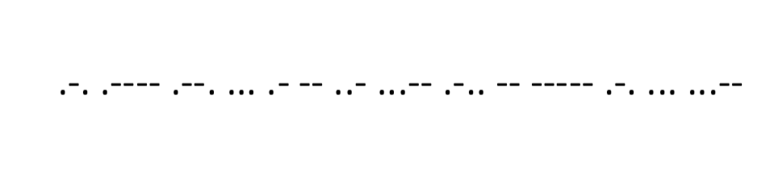

# Find the hidden code (Writeup)

The challenges give the VM file for enumerate to get the flag

Started with opening the VM file in Virtual Machine

The Windows user "APU-BOH2018" have password

We using the method using Windows recovery image for turn on the Command Prompt (CMD). After that change directory to

+ cd D:\Windows\System32\

)

**John-The-Ripper** that can crack the hash value by brute forcing the wordlists

To crack the PDF file for get the **hash value** by applied following command:

+ ./pdf2john.pl /home/user/Desktop/0ld\ is\ g0ld.pdf > PDFHash.hash

To crack the hash value for get the **password** by applied following command:

+ john --wordlist=/home/user/Desktop/rockyou.txt /home/user/Desktop/PDFHash.hash

The PDF sucessfully open.

To fine the hint in the PDF file by right click and click **Read aloud**

Something fishy viewed in the PDF viewer

The **Morse Code** language formatted.

Convert the morse code to text to view the **Flag**

passwords_are_useless@apuboh2018

**TIMEQUARTZER**

